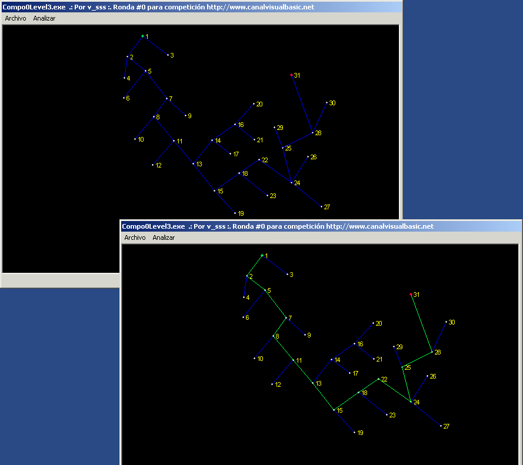



## FindNode \(Minimun nº nodes on a net\)

### Description

FindNodes its a source code to find the less number of nodes (routers) on a net. This is a extreamlly usefull under cert

circumstances, like traffic controls, congestion, bottle necks, etc. The code its heavy commented, but as you can see

it has a Advanced level. Read the ReadmeFirst.txt for important information. If you want to vote for this, thanks (i'm not looking for votes, only for sharing code with

the VB community ) or if you prefer dont vote this and vote another kiddy "cd-rom" open/close, "What is my IP", etc.

John
 
### More Info
 

             |
---                |---
**Submitted On**   |2003-10-14 03:20:40
**By**             |[John Ripper](https://github.com/Planet-Source-Code/PSCIndex/blob/master/ByAuthor/john-ripper.md)
**Level**          |Advanced
**User Rating**    |4.8 (19 globes from 4 users)
**Compatibility**  |VB 5\.0, VB 6\.0
**Category**       |[Miscellaneous](https://github.com/Planet-Source-Code/PSCIndex/blob/master/ByCategory/miscellaneous__1-1.md)
**World**          |[Visual Basic](https://github.com/Planet-Source-Code/PSCIndex/blob/master/ByWorld/visual-basic.md)
**Archive File**   |[FindNode\_\(172750422004\.zip](https://github.com/Planet-Source-Code/john-ripper-findnode-minimun-n-nodes-on-a-net__1-52807/archive/master.zip)

